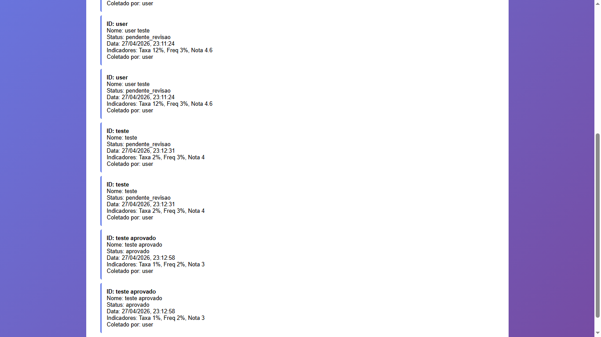

## BUG-COLETA-001 – Coletas são duplicadas ao serem enviadas

| Atributo | Descrição |
| --- | --- |
| **Caso de Teste Associado** | CT-WEB-COLETA-001, CT-WEB-COLETA-019 |
| **Severidade** | Alta |
| **Prioridade** | Alta |

## Reprodutibilidade
- [x] Sempre (100%)
- [ ] Intermitente
- [ ] Ocorreu uma vez

## Camada afetada
- [x] API
- [x] WEB
- [ ] CI/CD
- [x] Dados/Ambiente

## Descrição
Ao realizar o envio de uma coleta no sistema, o registro é apresentado de forma duplicada no histórico, resultando em inserções idênticas para a mesma coleta. Isso gera inconsistência nos dados, impacta relatórios e pode comprometer a integridade do sistema.

### Resultado esperado
Cada coleta deve ser registrada apenas uma única vez por envio, garantindo idempotência da operação e consistência dos dados. E não deve ser permitido envio de coleta idêntica.

### Resultado atual
O sistema não apenas permite que a mesma coleta seja registrada mais de uma vez, como duplica de forma automática, gerando duplicidade no banco de dados.

### Passos para reproduzir
1. Acessar a tela de coleta.
2. Preencher os dados da coleta corretamente.
3. Enviar a coleta.
5. Verificar no histórico que a mesma coleta foi registrada mais de uma vez.

## Evidências

## Estratégias de Mitigação Sugeridas
- Implementar controle de idempotência no backend para evitar múltiplos registros da mesma requisição.
- Criar validação de duplicidade com base em ID único da coleta.
- Bloquear reenvio duplicado no frontend após submissão bem-sucedida.