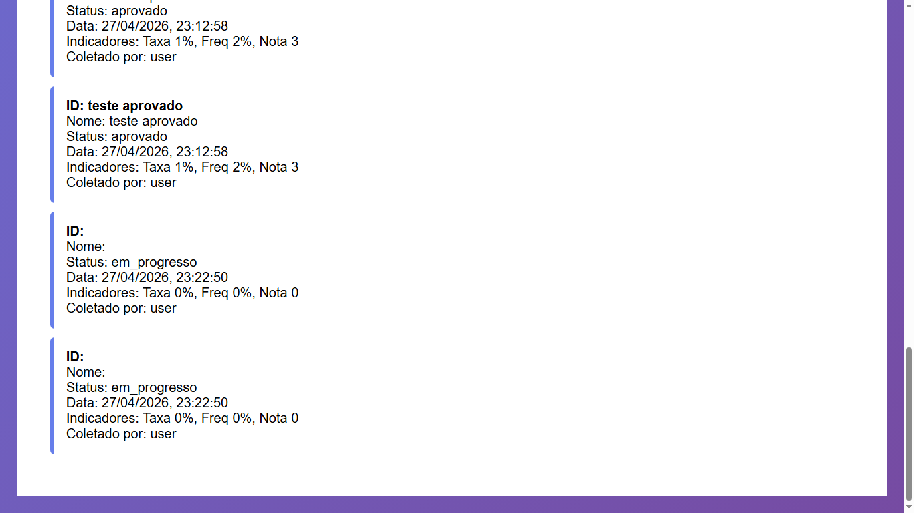

## BUG-COLETA-002 – Campos obrigatórios validados indevidamente

| Atributo | Descrição |
| --- | --- |
| **Caso de Teste Associado** | CT-WEB-COLETA-002 |
| **Severidade** | Média |
| **Prioridade** | Alta |

## Reprodutibilidade
- [x] Sempre (100%)
- [ ] Intermitente
- [ ] Ocorreu uma vez

## Camada afetada
- [x] WEB
- [x] API
- [ ] CI/CD
- [x] Dados/Ambiente

## Descrição
O sistema permite que os campos ID e Nome sejam preenchidos apenas com espaços em branco, sendo considerados como valores válidos, o que equivale a campos vazios. Além disso, o campo Status não está sendo corretamente tratado como obrigatório, permitindo o envio do formulário sem validação adequada.

### Resultado esperado
- Campos como ID e Nome não devem aceitar apenas espaços em branco como entrada válida.
- O campo Status deve ser obrigatório e impedir o envio caso não esteja preenchido corretamente.
- O sistema deve realizar validação de trimming (remoção de espaços) antes de validar a obrigatoriedade.

### Resultado atual
- O sistema aceita valores compostos apenas por espaços nos campos ID e Nome.
- O campo Status pode não ser preenchido corretamente e ainda assim o envio da coleta é permitida.

### Passos para reproduzir
1. Acessar a tela de cadastro/envio de coleta.
2. No campo **ID**, inserir apenas espaço.
3. No campo **Nome**, inserir apenas espaço.
4. Deixar o campo **Status** vazio.
5. Enviar o formulário.
6. Observar que o sistema permite o envio mesmo com dados inválidos.

## Evidências

## Estratégias de Mitigação Sugeridas
- Aplicar `trim()` nos campos antes da validação no frontend e backend.
- Impedir que strings vazias ou compostas apenas por espaços sejam consideradas válidas.
- Tornar o campo **Status** obrigatório com validação explícita no backend.
- Adicionar validação consistente entre frontend e backend para evitar bypass de regras.