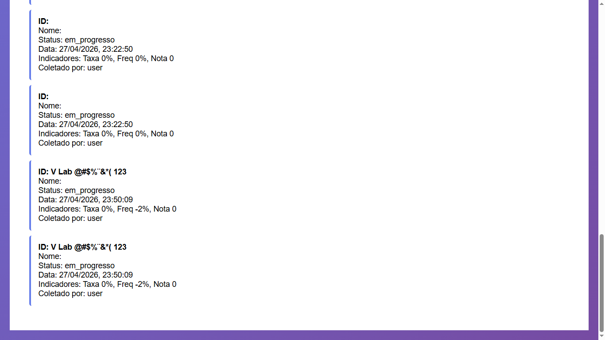
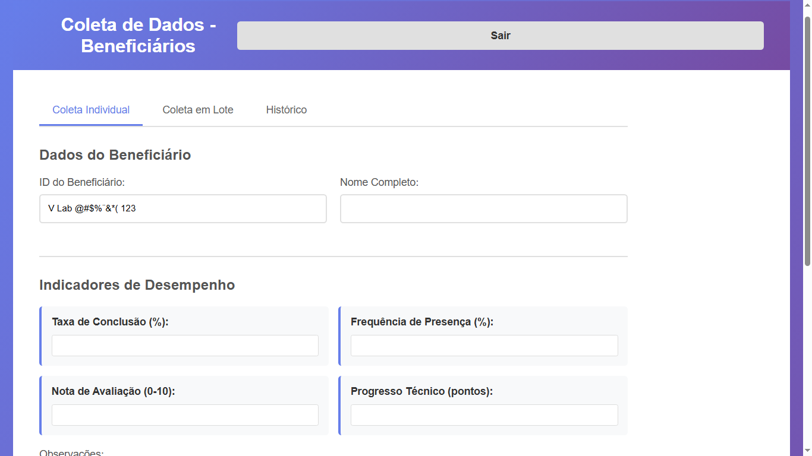

## BUG-COLETA-003 – ID do Beneficiário aceita caracteres inválidos

| Atributo | Descrição |
| --- | --- |
| **Caso de Teste Associado** | CT-WEB-COLETA-003, CT-WEB-COLETA-016 |
| **Severidade** | Alta |
| **Prioridade** | Alta |

## Reprodutibilidade
- [x] Sempre (100%)
- [ ] Intermitente
- [ ] Ocorreu uma vez

## Camada afetada
- [x] WEB
- [x] API
- [ ] CI/CD
- [x] Dados/Ambiente

## Descrição
O campo ID do Beneficiário não possui validação adequada e permite a inserção de **letras, espaços e caracteres especiais**, o que compromete a integridade dos dados e pode gerar inconsistências no processamento das coletas.

### Resultado esperado
O campo **ID do Beneficiário** deve aceitar apenas valores numéricos (ou o formato previamente definido pela regra de negócio), rejeitando:
- Letras
- Espaços
- Caracteres especiais

### Resultado atual
O sistema permite a inserção de qualquer tipo de caractere no campo de ID do Beneficiário, sem validação ou restrição.

### Passos para reproduzir
1. Acessar a tela de cadastro/envio de coleta.
2. Localizar o campo ID do Beneficiário.
3. Inserir valores como:
   - `abc123`
   - `12 34`
   - `@#$$%`
4. Enviar o formulário.
5. Observar que o sistema aceita os valores sem validação.

## Evidências

## Estratégias de Mitigação Sugeridas
- Implementar validação no frontend restringindo entrada apenas numérica.
- Validar no backend o formato permitido para o ID do beneficiário.
- Aplicar regex para garantir padrão estrito (ex: apenas dígitos).
- Bloquear submissão caso o valor não esteja dentro do formato esperado.