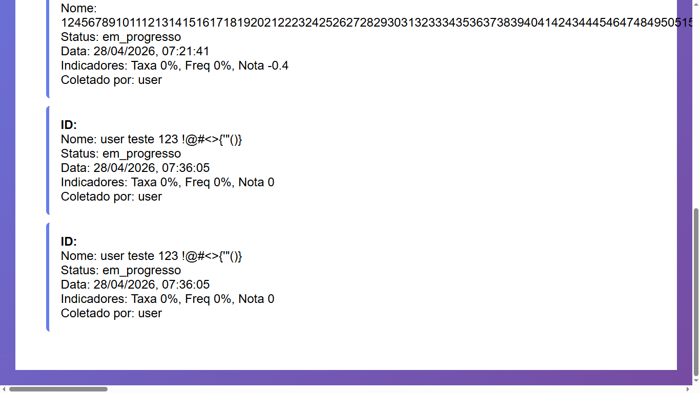

## BUG-COLETA-005 – Campo Nome permite números e caracteres especiais

| Atributo | Descrição |
| --- | --- |
| **Caso de Teste Associado** | CT-WEB-COLETA-004, CT-WEB-COLETA-016 |
| **Severidade** | Média |
| **Prioridade** | Alta |

## Reprodutibilidade
- [x] Sempre (100%)
- [ ] Intermitente
- [ ] Ocorreu uma vez

## Camada afetada
- [x] WEB
- [x] API
- [x] Banco de Dados
- [ ] CI/CD
- [x] Interface (UI)

## Descrição
O campo **Nome** permite a inserção de números e caracteres especiais sem validação adequada. Isso compromete a padronização dos dados, podendo gerar inconsistências no banco, dificuldades em consultas e problemas de exibição na interface.

### Resultado esperado
O campo Nome deve aceitar apenas caracteres válidos para nomes de pessoas (ex: letras e espaços), bloqueando:
- Números
- Caracteres especiais (ex: @, #, !, $, %, etc.)

### Resultado atual
O sistema permite a inserção de:
- Números
- Caracteres especiais
- Combinações inválidas no campo Nome

### Passos para reproduzir
1. Acessar a tela de cadastro/envio de coleta.
2. No campo **Nome**, inserir valores como:
   - `J0ão @Silva123`
   - `!!!Maria###`
   - `123456`
3. Salvar a coleta.
4. Observar que o sistema aceita o valor sem validação.

## Evidências

## Estratégias de Mitigação Sugeridas
- Implementar validação de formato no frontend (regex para letras e espaços).
- Validar novamente no backend para garantir consistência.
- Bloquear caracteres especiais e numéricos no campo Nome.