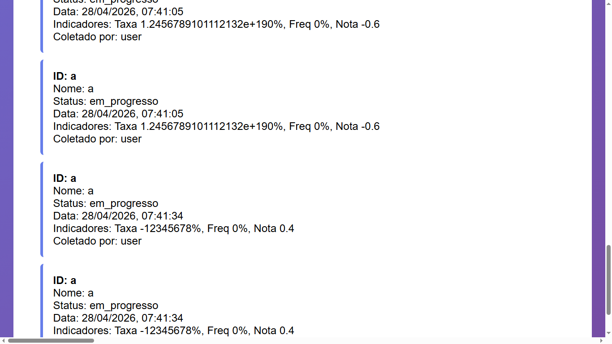

## BUG-COLETA-007 – Campo Taxa de Conclusão aceita valores inválidos

| Atributo | Descrição |
| --- | --- |
| **Caso de Teste Associado** | CT-WEB-COLETA-005, CT-WEB-COLETA-016 |
| **Severidade** | Alta |
| **Prioridade** | Alta |

## Reprodutibilidade
- [x] Sempre (100%)
- [ ] Intermitente
- [ ] Ocorreu uma vez

## Camada afetada
- [x] WEB
- [x] API
- [x] Banco de Dados
- [ ] Interface (UI)

## Descrição
O campo de Taxa de Conclusão (%) não possui validação adequada de intervalo nem de precisão numérica. O sistema permite a inserção de valores extremamente altos  e também valores negativos. Esses dados persistem e são exibidos no histórico, comprometendo a legibilidade e a consistência dos indicadores.

### Resultado esperado
- O campo taxa de Conclusão deve aceitar apenas valores numéricos dentro de um intervalo válido (ex: 0% a 100%).
- Não deve permitir números negativos.
- Não deve aceitar valores fora de precisão definida (evitar notação científica ou overflow).
- O valor exibido no histórico deve ser formatado corretamente.

### Resultado atual
- O sistema aceita valores extremamente grandes, exibidos como:
  - `Taxa 1.2456789101112132e+190%`
- O sistema permite valores negativos, exibidos como:
  - `Taxa -12345678%`

### Passos para reproduzir
1. Acessar a tela de cadastro/envio de coleta.
2. No campo **Taxa de Conclusão (%)**, inserir:
   - Um número extremamente grande
   - Um número negativo
3. Salvar a coleta.
4. Acessar o histórico de coletas.
5. Observar que os valores são exibidos sem validação ou restrição.

## Evidências

## Estratégias de Mitigação Sugeridas
- Definir intervalo válido para Taxa de Conclusão (0 a 100).
- Bloquear valores negativos no frontend e backend.