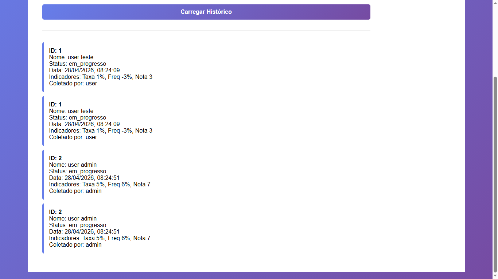

## BUG-COLETA-013 – Histórico exibe todas as coletas do sistema, não apenas do usuário autenticado

| Atributo | Descrição |
| --- | --- |
| **Caso de Teste Associado** | CT-WEB-COLETA-014 |
| **Severidade** | Crítica |
| **Prioridade** | Crítica |

## Reprodutibilidade
- [x] Sempre (100%)
- [ ] Intermitente
- [ ] Ocorreu uma vez

## Camada afetada
- [x] WEB
- [x] API
- [x] Banco de Dados
- [ ] CI/CD

## Descrição
O sistema permite que um usuário autenticado visualize **todas as coletas existentes no banco de dados**, independentemente de sua origem ou vínculo com o usuário logado. Isso indica falha de controle de acesso (autorização), permitindo exposição indevida de dados entre usuários.

### Resultado esperado
- O histórico deve exibir apenas as coletas vinculadas ao **usuário autenticado no momento**.
- O backend deve aplicar filtro por usuário (ex: `user`, `admin` ou equivalente).
- Nenhum usuário deve ter acesso a dados de outros usuários.

### Resultado atual
- O histórico retorna todas as coletas do sistema.
- Não há filtragem por usuário autenticado.
- Dados de múltiplos usuários são exibidos na mesma listagem.

### Passos para reproduzir
1. Realizar login no sistema com um usuário qualquer.
2. Acessar a tela de histórico de coletas.
3. Observar que são exibidas coletas de diferentes usuários.
4. Confirmar que não há restrição de dados por sessão autenticada.

## Evidências

## Estratégias de Mitigação Sugeridas
- Implementar controle de autorização no backend filtrando por usuário autenticado.
- Garantir que todas as queries do histórico incluam o identificador do usuário por meio de token.
- Validar permissões na camada de API (não apenas no frontend).
- Revisar arquitetura de autenticação e escopo de dados retornados.