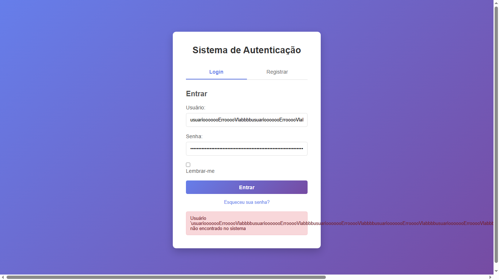

## BUG-LOGIN-001 – Campo de usuário não possui limitação de caracteres

| Atributo | Descrição |
| --- | --- |
| **Caso de Teste Associado** | CT-WEB-LOGIN-008 |
| **Severidade** | Média |
| **Prioridade** | Média |

## Reprodutibilidade
- [x] Sempre (100%)
- [ ] Intermitente
- [ ] Ocorreu uma vez

## Camada afetada
- [ ] API
- [x] WEB
- [ ] CI/CD
- [ ] Dados/Ambiente

## Descrição
Os campos Usuário e Senha na tela de login permite a inserção de uma quantidade excessiva de caracteres sem qualquer limitação ou validação. Isso causa problemas de usabilidade e inconsistência com regras esperadas de autenticação.

### Resultado esperado
Os campos Usuário e Senha deve possuir um limite máximo de caracteres e validar entradas inválidas, tanto no back-end quanto no front-end, impedindo que valores excessivamente longos sejam digitados ou submetidos.

### Resultado atual
O sistema permite inserir uma string muito longa nos campo Usuário e Senha.

### Passos para reproduzir
1. Acessar a tela de login do sistema.
2. No campo **Usuário**, inserir uma sequência muito longa de caracteres.
3. Observar que o campo aceita todo o conteúdo sem limitação ou validação.

## Evidências

## Estratégias de Mitigação Sugeridas
- Definir limite máximo de caracteres nos campos de Usuário e Senha. (ex: 50 ou 100 caracteres).
- Implementar validação no frontend para impedir entradas que excedam o limite.
- Garantir que o backend também valide o tamanho máximo do campo para evitar inconsistências.